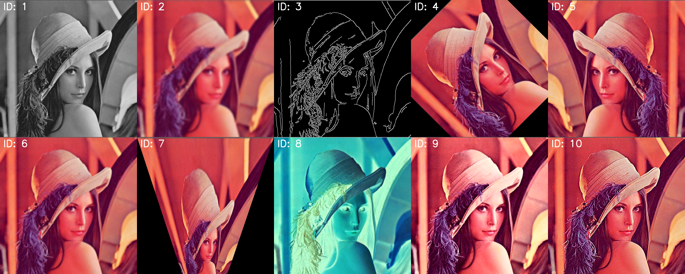
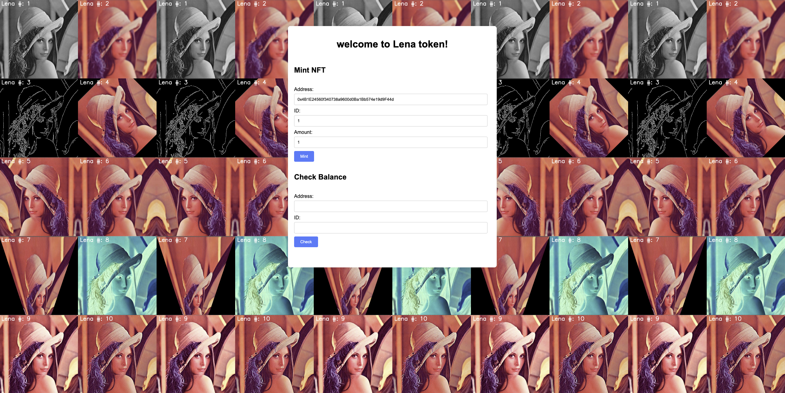

# ECR1155 NFTs - Lena Tokens



**Link to Lena Tokens: https://deapp.onrender.com/**


## 1. Technology and Tools

### Blockchain Platform: Ethereum

Ethereum is a decentralized, open-source blockchain system that features smart contract functionality. It is the most widely used blockchain platform for developing decentralized applications (dApps) and is known for its robust security and large developer community.

### Development Tools

- **Python with Flask**: Flask is a lightweight WSGI web application framework in Python. It is designed with simplicity and flexibility in mind, making it an excellent choice for backend development.
- **Solidity**: Solidity is a statically-typed programming language designed for developing smart contracts that run on the Ethereum Virtual Machine (EVM). It is the most popular language for writing Ethereum smart contracts.
- **Render**: Render is a cloud platform for deploying web applications and services. It simplifies the deployment process by providing a fully managed environment, allowing developers to focus on building their applications without worrying about infrastructure management. The Lena Token application is deployed on Render, ensuring high availability and scalability.
- **Image Generator**: A custom Python script is used to generate unique images for each Lena token. This script ensures that each token has a distinct visual representation.
- **Pinata**: Pinata is a service that allows users to upload files to IPFS (InterPlanetary File System). It is used to store the generated images and metadata on a decentralized storage network.

## 2. Implementation

### Smart Contracts

The smart contract for this project is written in Solidity and deployed on the Ethereum blockchain. The contract, named `Lena`, is an ERC1155 token contract with additional functionalities such as minting, burning, and transferring tokens. Below are the key components of the smart contract:

- **Minting**: The `mint` function allows users to mint new tokens by paying a specified mint fee. The function ensures that the minting does not exceed the maximum supply per NFT and the maximum mint amount per transaction.
- **Burning**: The `ERC1155Burnable` extension allows users to burn their tokens, reducing the total supply.
- **Transferring**: The `transferNFT` function allows the owner to transfer tokens from one address to another.
- **URI Management**: The `setURI` function allows the owner to set the URI for a specific token ID, and the `uri` function returns the URI for a given token ID.

The smart contract is deployed on the Sepolia testnet and can be viewed on Etherscan: [Etherscan Sepolia](https://sepolia.etherscan.io/address/0x3Af8acd2887A762E8c0151664e683cda8CBe3fA9).

### Image Generator

A custom Python script is used to generate unique images for each Lena token. This script ensures that each token has a distinct visual representation. The generator script uses various image processing libraries to create and manipulate images. Below is an example of the image generator script:

```python
# Processing methods
processing_methods = [
    ("Grayscale", apply_grayscale),
    ("Gaussian Blur", apply_gaussian_blur),
    ("Edge Detection", apply_edge_detection),
    ("Rotation", apply_rotation),
    ("Flip", apply_flip),
    ("Resize", apply_resize),
    ("Perspective Transform", apply_perspective_transform),
    ("Color Inversion", apply_color_inversion),
    ("Histogram Equalization", apply_histogram_equalization),
    ("Sharpen", apply_sharpen),
]
def apply_grayscale(image):
    return cv2.cvtColor(image, cv2.COLOR_BGR2GRAY)

def apply_gaussian_blur(image):
    return cv2.GaussianBlur(image, (15, 15), 0)

def apply_edge_detection(image):
    return cv2.Canny(image, 100, 200)

def apply_rotation(image, angle=45):
    (h, w) = image.shape[:2]
    center = (w // 2, h // 2)
    M = cv2.getRotationMatrix2D(center, angle, 1.0)
    return cv2.warpAffine(image, M, (w, h))

def apply_flip(image):
    return cv2.flip(image, 1)

def apply_resize(image, scale=0.5):
    return cv2.resize(image, None, fx=scale, fy=scale)

def apply_perspective_transform(image):
    (h, w) = image.shape[:2]
    pts1 = np.float32([[0, 0], [w, 0], [0, h], [w, h]])
    pts2 = np.float32([[0, 0], [w, 0], [int(0.33 * w), h], [int(0.66 * w), h]])
    M = cv2.getPerspectiveTransform(pts1, pts2)
    return cv2.warpPerspective(image, M, (w, h))

def apply_color_inversion(image):
    return cv2.bitwise_not(image)

def apply_histogram_equalization(image):
    if len(image.shape) == 2:
        return cv2.equalizeHist(image)
    else:
        ycrcb = cv2.cvtColor(image, cv2.COLOR_BGR2YCrCb)
        ycrcb[:, :, 0] = cv2.equalizeHist(ycrcb[:, :, 0])
        return cv2.cvtColor(ycrcb, cv2.COLOR_YCrCb2BGR)

def apply_sharpen(image):
    kernel = np.array([[0, -1, 0], [-1, 5, -1], [0, -1, 0]])
    return cv2.filter2D(image, -1, kernel)
  
# Process the original image
processed_images = []
target_size = (original_image.shape[1], original_image.shape[0])  # Target size for processed images
for i, (method_name, method) in enumerate(processing_methods):
    processed_image = method(original_image)
    
    # Make sure the processed image is in BGR format
    if len(processed_image.shape) == 2:
        processed_image = cv2.cvtColor(processed_image, cv2.COLOR_GRAY2BGR)
    
    # Scale the processed image to the original image size
    processed_image = cv2.resize(processed_image, target_size)
    
    processed_images.append((processed_image, i + 1))
    output_image_path = os.path.join(output_dir, f"image_{i+1}.png")
    cv2.imwrite(output_image_path, processed_image)
```

### Metadata Generator

A custom Python script is used to generate metadata for each Lena token. This metadata includes information such as the token ID, name, description, and the URL of the associated image. The metadata is essential for integrating with platforms like OpenSea. Below is an example of the metadata generator script:

```python
metadata_list = []
for i, (method_name, method) in enumerate(processing_methods):
	metadata = {
        "name": f"Lena #{i+1}",
        "description": f"This image was processed using {method_name}.",
        "image": f"ipfs://QmYztcstk9BbRoSi3NaWR23K9i2uffrhfMhuZCA5woWPnL/image_{i+1}.png", # IPFS URL
        "attributes": [
            {
                "trait_type": "Processing Method",
                "value": method_name
            }
        ]
    }
  metadata_list.append(metadata)
  # Save metadata to a JSON file
  metadata_file_path = os.path.join(output_dir, f"{i+1}.json")
  with open(metadata_file_path, 'w') as f:
      json.dump(metadata, f, indent=4)
```

#### Backend

The backend is developed using Python with Flask. The main functionalities include serving the frontend, handling form submissions, and interacting with the smart contract. Below is an example of the backend code:

```python
from flask import Flask,render_template

app=Flask(__name__)

@app.route('/',methods=["get","post"])
def index():
    return render_template('index.html')

if __name__=='__main__':
    app.run()
```

#### Frontend



The frontend is developed using HTML, CSS, and JavaScript. It includes forms for minting tokens and checking balances, and it interacts with the smart contract using Web3.js. Below is an example of the frontend code:

```html
<!DOCTYPE html>
<html lang="zh-cn">
<head>
    <meta charset="UTF-8">
    <meta name="viewport" content="width=device-width, initial-scale=1.0">
    <title>Lena Token</title>

	<link rel="icon" href="/static/original_photo.png" type="image/x-icon">

	<!--CSS-->
	<link href="{{ url_for('static', filename='styles.css') }}" rel="stylesheet">
</head>
<body>
    <div class="container">
		<h1>Wellcom to Lena token!</h1>
		<div class="form-container">
			<h2>Mint NFT</h2>
			<form id="mintForm">
				<div class="form-group">
					<label for="mintAddress">Address:</label>
					<input type="text" id="mintAddress" required>
				</div>
				<div class="form-group">
					<label for="mintId">ID:</label>
					<input type="number" id="mintId" required>
				</div>
				<div class="form-group">
					<label for="mintAmount">Amount:</label>
					<input type="number" id="mintAmount" required>
				</div>
				<button type="submit">Mint</button>
			</form>
		</div>
		<div class="form-container">
			<h2>Check Balance</h2>
			<form id="balanceForm">
				<div class="form-group">
					<label for="balanceAddress">Address:</label>
					<input type="text" id="balanceAddress" required>
				</div>
				<div class="form-group">
					<label for="balanceId">ID:</label>
					<input type="number" id="balanceId" required>
				</div>
				<button type="submit">Check</button>
			</form>
			<p id="balanceResult"></p>
		</div>
	</div>
	<!--JS-->
	<script src="https://cdn.jsdelivr.net/npm/web3@1.6.0/dist/web3.min.js"></script>
	<script src="{{ url_for('static', filename='script.js') }}"></script>
</body>

</html>
```

### Testing

Testing is a crucial part of the development process. The project undergoes regular testing to identify and fix bugs and to ensure optimal performance under different scenarios. The testing process includes:

- **Unit Testing**: Testing individual components of the smart contract and backend code to ensure they function correctly.
- **Integration Testing**: Testing the interaction between the frontend, backend, and smart contract to ensure seamless integration.

## 3. Documentation

#### Research

The research section includes an overview of blockchain technology, the Ethereum platform, and the ERC1155 token standard. It also covers the advantages and challenges of using blockchain for this project. Key points include:

- **Blockchain Technology**: A decentralized ledger that ensures transparency, security, and immutability.
- **Ethereum Platform**: A leading blockchain platform that supports smart contracts and decentralized applications (dApps).
- **ERC1155 Token Standard**: A multi-token standard that allows for the creation of fungible and non-fungible tokens within a single contract.

#### Design Choices

The design choices section explains the rationale behind selecting Ethereum, Solidity, Flask, Render, and other tools and technologies used in the project. It also covers the design of the smart contract and the overall system architecture. Key points include:

- **Ethereum**: Chosen for its robust smart contract capabilities and large developer community.
- **Solidity**: Selected for writing the smart contract due to its compatibility with the Ethereum Virtual Machine (EVM).
- **Flask**: Used for backend development due to its simplicity and flexibility.
- **Render**: Chosen for deploying the web application due to its fully managed environment and ease of use.
- **Image and Metadata Generators**: Custom Python scripts were developed to ensure each token has a unique visual representation and detailed metadata.

#### Development Process

The development process section provides a detailed account of the steps taken to develop the project. It includes the implementation of the smart contract, backend, and frontend, as well as the integration of these components. Key points include:

- **Smart Contract Development**: Writing and deploying the ERC1155 smart contract on the Ethereum Sepolia testnet.
- **Backend Development**: Using Flask to handle form submissions and interact with the smart contract.
- **Frontend Development**: Creating a user-friendly interface using HTML, CSS, and JavaScript to interact with the smart contract.
- **Integration**: Ensuring seamless communication between the frontend, backend, and blockchain components.

#### Challenges

The challenges section discusses the difficulties encountered during the development process and the solutions implemented to overcome them. Common challenges include:

- **Smart Contract Security**: Ensuring the smart contract is secure and free from vulnerabilities.
- **Gas Optimization**: Minimizing gas costs for transactions on the Ethereum network.
- **Frontend-Backend Integration**: Ensuring smooth communication between the frontend and backend components.
- **Deployment**: Managing the deployment process on Render to ensure high availability and scalability.

#### Outcomes

The outcomes section summarizes the results of the project, including the successful deployment of the smart contract, the functionality of the frontend and backend, and the performance of the system under different scenarios. It also includes user feedback and potential areas for future improvement. Key points include:

- **Successful Deployment**: The smart contract was successfully deployed on the Sepolia testnet.
- **Functionality**: The frontend and backend components function as expected, allowing users to mint tokens, check balances, and interact with the smart contract.
- **Performance**: The system performs well under various load conditions, demonstrating its scalability and robustness.
- **Future Improvements**: Potential areas for improvement include deploying on the Ethereum mainnet, adding advanced features, enhancing the user interface, and conducting security audits.

### Additional Information

- **Etherscan Sepolia**: The smart contract is deployed on the Sepolia testnet and can be viewed on Etherscan: [Etherscan Sepolia](https://sepolia.etherscan.io/address/0x3Af8acd2887A762E8c0151664e683cda8CBe3fA9).
- **OpenSea Testnet**: The Lena token collection is available on the OpenSea testnet: [OpenSea Testnet](https://testnets.opensea.io/zh-CN/collection/lena-5).
- **Github**: The Lena token is open source on the github: [Lena_token](https://github.com/FoeverA0/Lena_Token)
- **Render Deployment**: The Lena Token application is deployed on Render: [Lena Token Render Deployment](https://deapp.onrender.com/).

---

This report provides a detailed account of the technology and tools used, the implementation process, and the documentation of the project. It serves as a comprehensive guide for understanding the development and deployment of the Lena token project.
